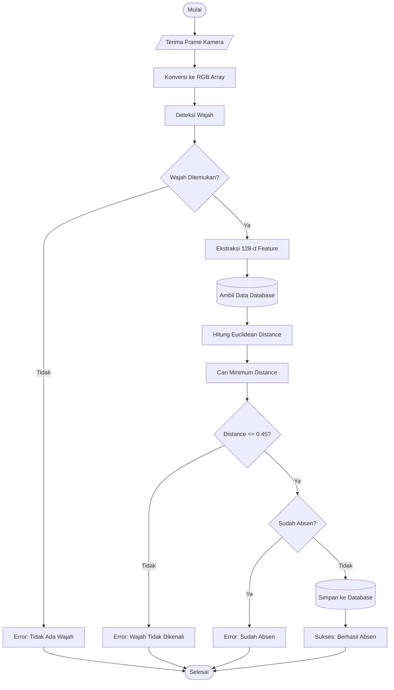

# Flowchart Sistem Absensi Face Recognition

Berikut adalah flowchart logika sistem absensi yang dapat Anda gunakan untuk laporan atau skripsi Anda. Anda dapat mengambil *screenshot* (tangkapan layar) dari diagram di bawah ini.

