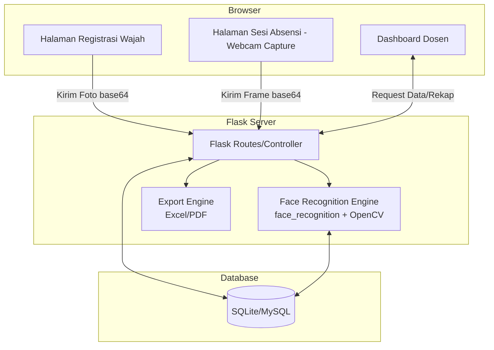
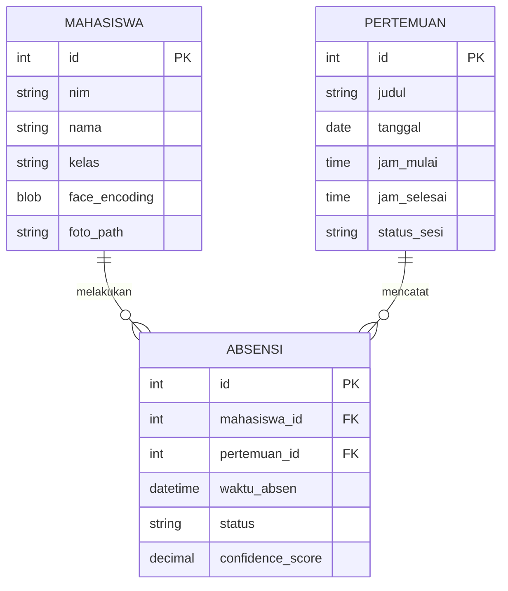

# PRD — Project Requirements Document

## 1. Overview

Saat ini, proses absensi mahasiswa di kelas masih dilakukan secara manual — baik melalui tanda tangan di kertas maupun panggilan nama satu per satu. Metode ini memakan waktu, rentan terhadap kesalahan pencatatan, dan yang paling krusial: rawan **titip absen**, di mana mahasiswa yang tidak hadir secara fisik tetap tercatat hadir karena dititipkan oleh temannya.

**Tujuan Utama:** Membangun aplikasi web absensi mahasiswa berbasis **Face Recognition** untuk satu kelas/mata kuliah, yang secara otomatis mendeteksi dan mencocokkan wajah mahasiswa saat sesi absensi berlangsung. Sistem ini menghilangkan kemungkinan titip absen, mempercepat proses pencatatan kehadiran, dan menyediakan rekap kehadiran yang akurat dan siap diekspor bagi dosen.

## 2. Requirements

- **Akurasi Pengenalan Wajah:** Sistem wajib mampu mengenali wajah mahasiswa secara konsisten menggunakan face encoding, walau dengan variasi pencahayaan dan sudut wajah ringan.
- **Pemrosesan Terpusat di Server:** Deteksi dan pencocokan wajah dilakukan sepenuhnya di backend (Python) agar hasil konsisten; browser hanya bertugas menangkap gambar dari webcam.
- **Registrasi Wajah Sekali Proses:** Mahasiswa mendaftarkan wajahnya sekali (dengan beberapa foto) di awal, lalu bisa langsung dipakai untuk seluruh sesi absensi berikutnya.
- **Manajemen Sesi oleh Dosen:** Dosen dapat membuka dan menutup sesi absensi per pertemuan, sehingga pencatatan hanya berlaku pada jendela waktu yang ditentukan.
- **Rekap & Ekspor Laporan:** Dosen dapat melihat rekap kehadiran per mahasiswa/per pertemuan dan mengekspornya ke Excel/PDF.
- **Pencegahan Duplikasi Absen:** Satu mahasiswa hanya bisa tercatat hadir satu kali per sesi, meskipun terdeteksi kamera berkali-kali.

## 3. Core Features

Fitur dikelompokkan berdasarkan fase pengerjaan (mengikuti timeline pengerjaan skripsi).

### Fase 1

- **Registrasi & Manajemen Data Mahasiswa** \[high\] — Fondasi data sebelum sistem bisa mengenali siapa pun.
  - **Registrasi Wajah:** Mahasiswa mengisi NIM & nama, lalu mengambil 3–5 foto wajah via webcam untuk di-generate menjadi face encoding.
  - **CRUD Data Mahasiswa:** Admin/dosen dapat menambah, mengedit, atau menghapus data mahasiswa.
  - **Manajemen Pertemuan:** Dosen dapat membuat jadwal pertemuan (tanggal, jam mulai/selesai, topik).

### Fase 2

- **Modul Absensi Otomatis** \[high\] — Inti dari sistem, menggantikan pencatatan manual.
  - **Buka/Tutup Sesi Absensi:** Dosen mengaktifkan sesi absensi untuk pertemuan tertentu dalam rentang waktu tertentu.
  - **Deteksi & Pencocokan Wajah Real-time:** Backend memproses frame dari kamera, mendeteksi wajah, dan mencocokkannya dengan encoding tersimpan.
  - **Pencatatan Kehadiran Otomatis:** Saat wajah cocok, sistem otomatis mencatat status hadir beserta timestamp dan confidence score.
  - **Notifikasi Hasil Deteksi:** Feedback visual di layar (nama + status "Hadir") setiap kali wajah berhasil dikenali.

### Fase 3

- **Dashboard & Laporan** \[medium\] — Ruang kendali dosen untuk memantau kehadiran.
  - **Rekap Kehadiran:** Tabel kehadiran per mahasiswa dan per pertemuan.
  - **Ekspor Laporan:** Unduh rekap dalam format Excel/PDF.
  - **Ringkasan Statistik:** Grafik persentase kehadiran per mahasiswa/kelas.
- **Riwayat Absensi Mandiri** \[medium\] — Akses mahasiswa untuk memantau kehadirannya sendiri.
  - **Cek Riwayat via NIM:** Mahasiswa memasukkan NIM di halaman khusus untuk melihat status dan riwayat kehadirannya, tanpa perlu login akun penuh.

### Fase 4

- **Anti-Kecurangan (Opsional)** \[low\] — Lapisan keamanan tambahan untuk mempersulit pemalsuan absensi.
  - **Liveness Check Sederhana:** Deteksi kedipan mata atau gerakan kecil untuk memastikan yang di depan kamera adalah orang asli, bukan foto statis.

## 4. User Flow

**Alur Mahasiswa:**

1. Mahasiswa membuka website sistem absensi.
2. Mahasiswa masuk ke halaman absensi.
3. Mahasiswa mengaktifkan kamera pada perangkat yang digunakan.
4. Mahasiswa mengarahkan wajah ke kamera.
5. Sistem mengambil citra wajah mahasiswa.
6. Sistem melakukan Face Detection untuk mendeteksi wajah (fitur *Deteksi & Pencocokan Wajah Real-time*, Fase 2).
7. Jika wajah berhasil terdeteksi, sistem melanjutkan proses Face Recognition (Fase 2).
8. Sistem mencocokkan wajah dengan data wajah mahasiswa yang telah terdaftar (data dari fitur *Registrasi Wajah*, Fase 1).
9. Jika wajah dikenali dan identitas sesuai, sistem melakukan verifikasi identitas mahasiswa (Fase 2).
10. Sistem mencatat NIM, nama, tanggal, waktu, dan status kehadiran ke dalam database (fitur *Pencatatan Kehadiran Otomatis*, Fase 2).
11. Sistem menampilkan informasi bahwa absensi berhasil dilakukan (fitur *Notifikasi Hasil Deteksi*, Fase 2).
12. Mahasiswa dapat melihat status atau riwayat absensinya (fitur *Riwayat Absensi Mandiri*, Fase 3).

**Alur Jika Wajah Tidak Dikenali:**

1. Mahasiswa mengarahkan wajah ke kamera.
2. Sistem melakukan Face Detection (Fase 2).
3. Sistem melakukan Face Recognition (Fase 2).
4. Wajah tidak ditemukan dalam data mahasiswa yang terdaftar.
5. Sistem tidak mencatat absensi.
6. Sistem menampilkan informasi bahwa wajah belum berhasil dikenali (fitur *Notifikasi Hasil Deteksi*, Fase 2).
7. Mahasiswa dapat melakukan proses pengenalan kembali.

**Alur Dosen:**

1. Dosen login ke dashboard dan membuat jadwal pertemuan baru (Fase 1).
2. Saat kelas dimulai, dosen membuka sesi absensi untuk pertemuan tersebut (Fase 2).
3. Sistem mencatat kehadiran mahasiswa secara otomatis selama sesi berlangsung.
4. Dosen menutup sesi absensi setelah waktu yang ditentukan berakhir.
5. Dosen membuka menu rekap untuk melihat dan mengekspor laporan kehadiran (Fase 3).

## 5. Architecture

Sistem menggunakan arsitektur terpusat di mana seluruh logika pengenalan wajah berjalan di backend Python (Flask), sementara browser hanya berperan sebagai penangkap gambar (capture) dari webcam.



## 6. Database Schema

```
mahasiswa
- id (PK)
- nim
- nama
- kelas
- face_encoding (blob/array)
- foto_path

pertemuan
- id (PK)
- judul
- tanggal
- jam_mulai
- jam_selesai
- status_sesi (buka/tutup)

absensi
- id (PK)
- mahasiswa_id (FK -> mahasiswa)
- pertemuan_id (FK -> pertemuan)
- waktu_absen
- status
- confidence_score
```



## 7. Tech Stack

- **Backend:** Python (Flask), menjalankan seluruh logika deteksi & pencocokan wajah di server-side agar konsisten.
- **Face Recognition:** `face_recognition` (berbasis dlib) dipadukan dengan OpenCV untuk pemrosesan gambar.
- **Database:** SQLite untuk tahap pengembangan/skripsi; dapat dinaikkan ke MySQL bila dibutuhkan skala lebih besar.
- **ORM:** SQLAlchemy untuk manajemen model & query database.
- **Frontend:** HTML, CSS, Bootstrap, dan JavaScript — menggunakan `getUserMedia` untuk mengakses webcam dan mengirim frame ke backend.
- **Export Laporan:** Library seperti `openpyxl` (Excel) atau `reportlab`/`weasyprint` (PDF).
- **Deployment:** Cukup dijalankan secara lokal (localhost) untuk keperluan skripsi/demo; dapat di-deploy ke VPS sederhana bila perlu diakses online.